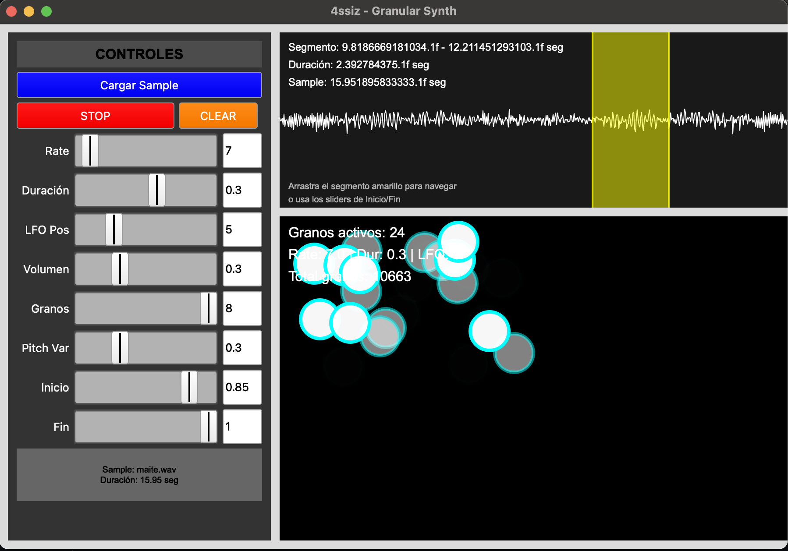

# Assiz Alcaraz - Granular Synth
## Trabajo Final Integrador- Teoría del Audio Digital
### Universidad Nacional de las Artes - año 2025



---

## 1. DESCRIPCIÓN DEL PROYECTO

Este proyecto implementa un **sintetizador granular** utilizando SuperCollider, aplicando los conceptos teóricos de la **Unidad 2: Técnicas de síntesis y procesamiento** del programa de Teoría del Audio Digital.

### 1.1 Modalidad Elegida
**Opción 2: Implementación y Documentación de un Sintetizador Híbrido**

---
## 2. FUNDAMENTOS TEÓRICOS

### 2.1 Síntesis Granular
La síntesis granular es una técnica de síntesis que opera sobre **granos** (pequeños fragmentos de sonido de 10-100ms de duración). Cada grano es procesado individualmente y luego recombinado para crear texturas sonoras complejas.

### 2.2 Implementación Técnica
- **Algoritmo principal**: `GrainBuf.ar` de SuperCollider
- **Modulación de posición**: LFO (`LFNoise1.kr`) para controlar dónde se lee en el buffer
- **Panning aleatorio**: Distribución espacial del sonido
- **Control de gate**: Envelope ASR para manejo de la síntesis

---

## 3. ARQUITECTURA DEL SISTEMA

### 3.1 SynthDef Principal
```supercollider
SynthDef(\granularLoFi, {
    |buf = 0, grainRate = 20, grainDur = 0.1, posFreq = 5, gain = 0.3, gate = 1, grainCount = 1, pitchVariation = 0.0, segmentStart = 0.0, segmentEnd = 1.0|
    var pos, sig, pan, env, grains;
    
    // Envelope para control de gate
    env = EnvGen.kr(Env.asr(0.1, 1, 0.1), gate, doneAction: 2);
    
    // Generar múltiples granos simultáneos
    grains = Array.fill(8) { |i|
        var grainPos, grainPan, grainSig, grainActive, grainPitch;
        
        // Determinar si este grano está activo
        grainActive = (i < grainCount);
        
        // Posición aleatoria en el segmento seleccionado
        grainPos = LFNoise1.kr(posFreq + (i * 0.3)).range(segmentStart, segmentEnd) * BufFrames.kr(buf);
        
        // Variación aleatoria de pitch para cada grano
        grainPitch = 1.0 + (LFNoise1.kr(0.2 + (i * 0.4)) * pitchVariation);
        
        // Síntesis granular individual con trigger independiente
        grainSig = GrainBuf.ar(
            numChannels: 1,
            trigger: Impulse.kr(grainRate + (i * 0.1)) * grainActive,
            dur: grainDur,
            sndbuf: buf,
            rate: grainPitch,
            pos: grainPos / BufFrames.kr(buf),
            interp: 2
        );

        // Panning aleatorio para cada grano
        grainPan = LFNoise1.kr(0.5 + (i * 0.5)).range(-1, 1);
        
        // Aplicar panning y activación
        Pan2.ar(grainSig * grainActive, grainPan);
    };
    
    // Sumar todos los granos
    sig = Mix(grains);
    
    // Envío de triggers para visualización
    SendTrig.kr(Impulse.kr(grainRate), 0, grainDur);
        
    // Aplicar ganancia y envelope
    sig = sig * gain * env;

    Out.ar(0, sig);
}).add;
```

### 3.2 Sistema de Visualización
- **OSCdef**: Recibe triggers del sintetizador para visualizar granos
- **UserView**: Canvas para dibujar granos en tiempo real con fade out
- **Visualización de forma de onda**: Muestra el sample completo con segmento seleccionable
- **Selección de segmento**: Drag & drop para definir región de loop
- **Actualización automática**: Task que refresca la visualización cada 50ms

### 3.3 Interfaz de Usuario
- **GUI unificada**: Controles y visualización en una sola ventana
- **Controles en tiempo real**: Todos los parámetros actualizan el sintetizador inmediatamente
- **Selector de archivos**: Carga de samples integrada con información del archivo
- **Botones de control**: Play/Stop toggle, Clear (funcional)
- **Visualización de información**: Granos activos, parámetros actuales, información del sample

---

## 4. PARÁMETROS DE CONTROL

### 4.1 Parámetros Principales
- **Rate (1-100 Hz)**: Velocidad de generación de granos
- **Duración (0.01-0.5s)**: Duración de cada grano individual
- **LFO Pos (0.1-20 Hz)**: Frecuencia del LFO que controla la posición en el buffer
- **Volumen (0-1)**: Nivel de salida del sintetizador
- **Granos (1-8)**: Cantidad de granos simultáneos generados
- **Pitch Var (0-100%)**: Variación aleatoria de pitch entre granos
- **Inicio/Fin (0-1)**: Segmento de loop en el buffer de audio

### 4.2 Parámetros Internos
- **Interpolación**: Interpolación cúbica (valor 2) para suavizar transiciones
- **Panning**: Distribución aleatoria en el campo estéreo por grano
- **Gate**: Control de encendido/apagado del sintetizador
- **Máximo granos simultáneos**: 300 granos activos al mismo tiempo
- **Sincronización**: Sistema OSC para comunicación audio-visual

---

## 5. ASPECTOS TÉCNICOS RELEVANTES

### 5.1 Teorema de Muestreo
El sintetizador respeta el teorema de Nyquist-Shannon al trabajar con buffers de audio muestreados correctamente.

### 5.2 Cuantización y Dithering
- **Interpolación cúbica**: Reduce artefactos de cuantización en la lectura del buffer
- **Modulación suave**: LFO de baja frecuencia evita discontinuidades

### 5.3 Protocolos de Control
- **OSC (Open Sound Control)**: Para comunicación entre síntesis y visualización
- **Triggers**: Sistema de mensajes para sincronización temporal

---

## 6. IMPLEMENTACIÓN PRÁCTICA

### 6.1 Flujo de Trabajo
1. **Inicialización**: Carga del servidor y registro del SynthDef
2. **Carga de sample**: Selección y carga de archivo de audio con visualización de forma de onda
3. **Selección de segmento**: Drag & drop para definir región de loop
4. **Síntesis**: Generación de múltiples granos simultáneos con parámetros ajustables
5. **Visualización**: Representación gráfica en tiempo real con sincronización perfecta
6. **Control**: Modificación de parámetros en tiempo real con actualización inmediata

### 6.2 Gestión de Memoria
- **Buffers**: Liberación automática al cambiar samples
- **Granos**: Limpieza automática de granos expirados cada 2 segundos
- **Máximo simultáneo**: Control de 300 granos activos máximo
- **Ventanas**: Cierre correcto de recursos al salir
- **OSC**: Limpieza automática de mensajes OSC

---

## 7. POSIBILIDADES EXPRESIVAS

### 7.1 Texturas Sonoras
- **Granulación densa**: Rate alto + duración corta + múltiples granos
- **Texturas ambientales**: Rate bajo + duración larga + variación de pitch
- **Efectos de glitch**: Modulación rápida del LFO + segmentos cortos
- **Texturas complejas**: Combinación de múltiples granos con pitch variado

### 7.2 Control Espacial
- **Panning aleatorio**: Distribución dinámica en el campo estéreo por grano
- **Densidad variable**: Control de la cantidad de granos simultáneos (1-8)
- **Segmentación**: Control preciso de la región de loop en el buffer
- **Variación de pitch**: Cada grano puede tener pitch diferente

### 7.3 Nuevas Posibilidades
- **Sincronización visual**: Feedback visual inmediato de la síntesis
- **Control de segmento**: Manipulación precisa de la región de audio
- **Múltiples granos**: Hasta 8 granos simultáneos con características independientes
- **Variación de pitch**: Cada grano puede tener pitch diferente para texturas complejas

---

## 8. CONCLUSIONES

Este sintetizador granular avanzado demuestra la aplicación práctica de los conceptos teóricos de síntesis de sonido, específicamente:

- **Síntesis granular**: Implementación directa de la técnica con múltiples granos simultáneos
- **Modulación**: Uso de LFOs para control de parámetros y variación de pitch
- **Procesamiento de señales**: Manipulación de buffers de audio con segmentación precisa
- **Interfaz humano-máquina**: Control en tiempo real con sincronización audio-visual
- **Visualización**: Feedback visual inmediato de la síntesis granular
- **Control espacial**: Panning aleatorio y distribución dinámica del sonido

### 8.1 Logros Técnicos
- **Sincronización perfecta**: Audio y visualización perfectamente sincronizados
- **Múltiples granos**: Hasta 8 granos simultáneos con características independientes
- **Control de segmento**: Manipulación precisa de la región de loop
- **Variación de pitch**: Cada grano puede tener pitch diferente
- **Gestión de memoria**: Control eficiente de hasta 300 granos simultáneos
- **Interfaz unificada**: GUI completa con controles y visualización integrados

### 8.2 Cumplimiento de Objetivos
El proyecto cumple con los objetivos de la **Opción 2** al:
- Implementar una técnica de síntesis específica (granular) con características avanzadas
- Documentar exhaustivamente el código y la arquitectura del sistema
- Proporcionar una herramienta funcional para la creación musical
- Demostrar aplicación práctica de conceptos teóricos de audio digital
- Incluir visualización y control en tiempo real

---

## 9. CARACTERÍSTICAS TÉCNICAS AVANZADAS

### 9.1 Sistema de Visualización
- **Canvas en tiempo real**: Dibujo de granos con fade out visual
- **Forma de onda completa**: Visualización del sample completo con segmento seleccionable
- **Selección por drag & drop**: Interfaz intuitiva para definir región de loop
- **Información en tiempo real**: Contador de granos activos y parámetros actuales
- **Sincronización OSC**: Comunicación entre síntesis y visualización

### 9.2 Gestión de Recursos
- **Control de memoria**: Máximo 300 granos simultáneos para evitar sobrecarga
- **Limpieza automática**: Granos expirados se eliminan cada 2 segundos
- **Actualización en tiempo real**: Todos los controles actualizan el sintetizador inmediatamente
- **Gestión de buffers**: Liberación automática al cambiar samples

### 9.3 Arquitectura Modular
- **SynthDef parametrizado**: Todos los parámetros controlables desde la GUI
- **Sistema de triggers**: Comunicación OSC entre síntesis y visualización
- **Funciones de utilidad**: Carga de samples, limpieza, actualización
- **GUI unificada**: Interfaz completa en una sola ventana

---

## 10. BIBLIOGRAFÍA

- Roads, Curtis (1995): *The Computer Music Tutorial*, MIT Press
- Di Liscia, O. P. (2004): *Síntesis y Procesamiento de Sonido y Música a través del programa Csound*, UNQ
- Moore, F.R. (1990): *Elements of Computer Music*, Prentice Hall
- Documentación oficial de SuperCollider: https://supercollider.github.io/

---

## 11. INFORMACIÓN DEL PROYECTO

**Versión Final**: 1.0  
**Fecha de Finalización**: Septiembre 2025  
**Autor**: Alcaraz Baxter José Assiz   
**Institución**: Universidad Nacional de las Artes (UNA)  
**Materia**: Teoría del Audio Digital  
**Modalidad**: Opción 2 - Implementación y Documentación de un Sintetizador Híbrido  
